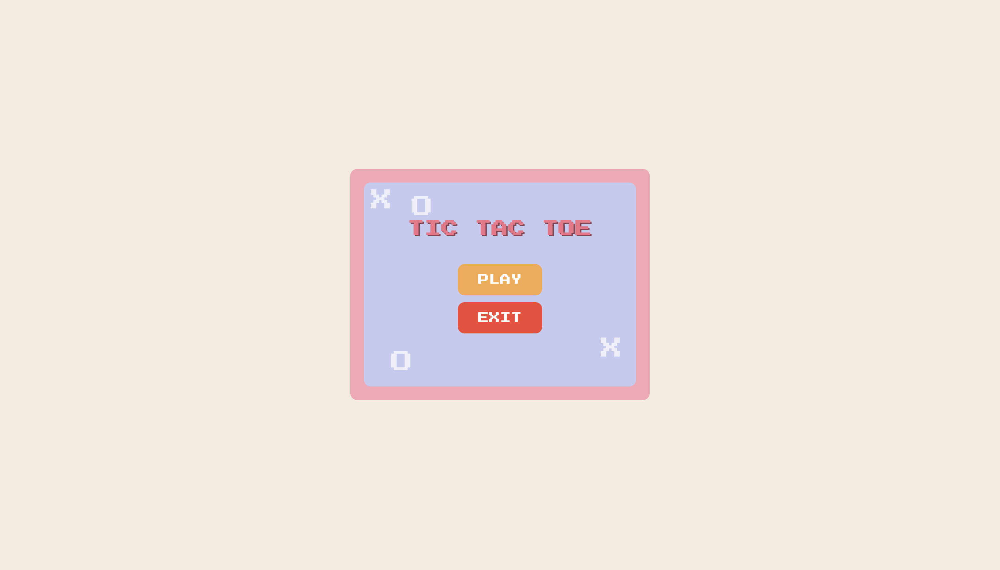

# tic-tac-toe
Tic Tac Toe Game is a web-based implementation of the classic Tic Tac Toe game using HTML, CSS, and JavaScript. 
# Tic Tac Toe Game

A fun, interactive web-based Tic Tac Toe game built with HTML, CSS, and JavaScript.

## Demo



## Features

- Classic 3x3 Tic Tac Toe gameplay.
- Interactive start, loading, and try-again screens.
- Highlights win, lose, and draw conditions.
- Responsive design and visually appealing animations.
- Option to play again or exit the game.

## Installation

1. Clone the repository:
   ```bash
   git clone https://github.com/yourusername/tic-tac-toe.git

2.	Open index.html in your browser to start playing.

Usage
	•	Click PLAY to start the game.
	•	Take turns placing X and O on the board.
	•	The game detects a win, loss, or draw automatically.
	•	After the game ends, you can choose PLAY AGAIN or GIVE UP.

Technologies Used
	•	HTML5
	•	CSS3
	•	JavaScript (Vanilla JS)
	•	Google Fonts (Press Start 2P)
 
Folder Structure

tic-tac-toe/
│
├── index.html       # Main HTML file
├── README.md        # Project documentation
└── assets/          # Optional: images or screenshots

Contributing

Contributions are welcome! Feel free to submit a Pull Request or open an Issue.

License

This project is open-source and free to use.
