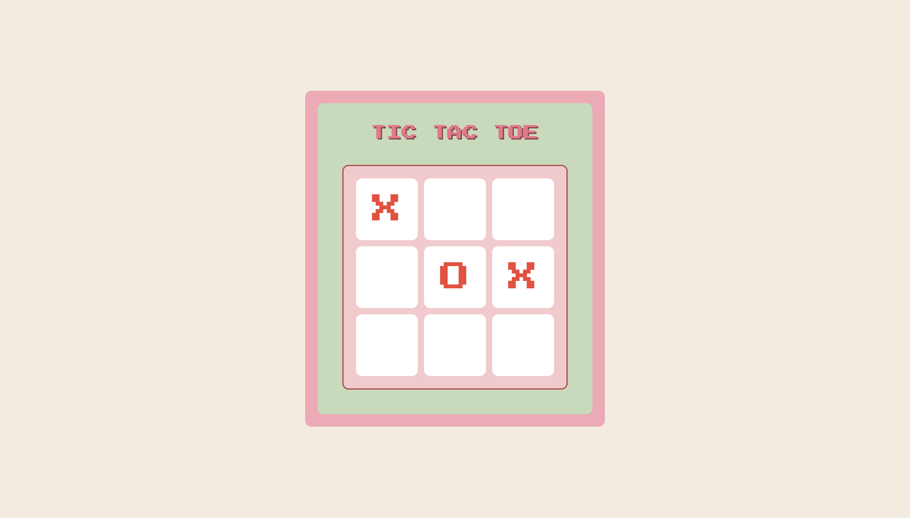

# Tic Tac Toe Game

A fun, interactive, web-based Tic Tac Toe game built with HTML, CSS, and JavaScript.

## 🕹️ Demo

Take a look at the game in action!




## ✨ Features

- **Classic 3x3 grid gameplay:** Play against a friend or challenge yourself.
- **Interactive screens:** Start, loading, and try-again screens for smooth user experience.
- **Automatic win, lose, and draw detection:** Highlights game results instantly.
- **Responsive design:** Looks great on desktops, tablets, and phones.
- **Animated UI:** Enjoy visually appealing transitions and feedback.
- **Replay and exit options:** Choose to play again or leave the game after each match.

## 🚀 Getting Started

1. **Clone the repository:**
   ```bash
   git clone https://github.com/SaniaDebbarma/tic-tac-toe.git
   ```
2. **Open `index.html` in your browser** to start playing the game.

## 📝 Usage

- Click **PLAY** to begin.
- Take turns placing **X** and **O** on the board.
- The game will automatically detect if you win, lose, or draw.
- After the game ends, click **PLAY AGAIN** to restart or **GIVE UP** to exit.

## 🛠️ Technologies Used

- **HTML5**
- **CSS3**
- **JavaScript (Vanilla JS)**
- **Google Fonts:** [Press Start 2P](https://fonts.google.com/specimen/Press+Start+2P)

## 📁 Folder Structure

```
tic-tac-toe/
├── index.html       # Main HTML file
├── README.md        # Project documentation
└── assets/          # Images and screenshots
```

## 🤝 Contributing

Contributions are welcome!  
Feel free to submit a [Pull Request](https://github.com/SaniaDebbarma/tic-tac-toe/pulls) or open an [Issue](https://github.com/SaniaDebbarma/tic-tac-toe/issues).

## 📄 License

This project is open-source and free to use.
